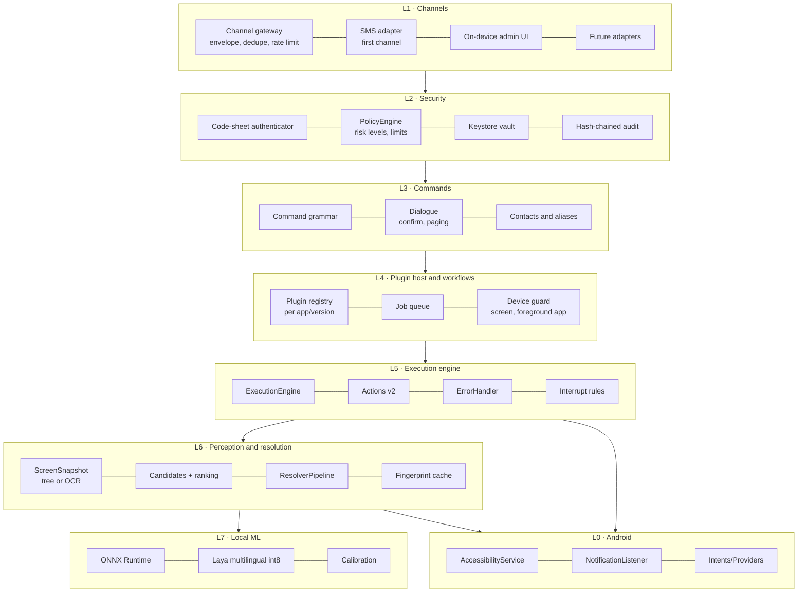
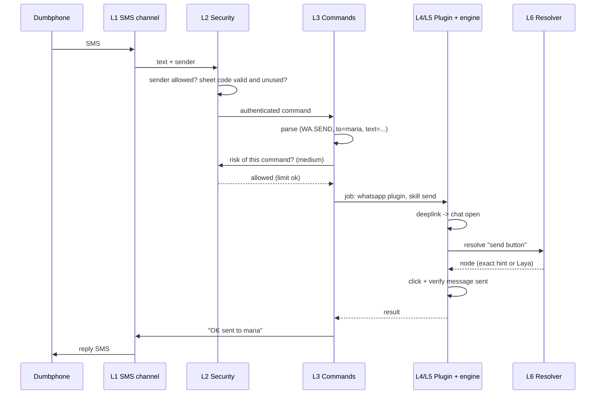

# Vision and Target Architecture — Remotely Controlled Android Automation Layer

| Field | Value |
|-------|-------|
| **Status** | Proposal (draft v0.2) — for review |
| **Date** | 2026-09-30 |
| **Context** | Evolution of the PROJ-000 POC (Phase 1) into a resilient, offline automation runtime with a plugin system, reachable through several contact channels (SMS first) |

## Document map

| Document | Content |
|----------|---------|
| [decision-report.md](decision-report.md) | **Start here:** consolidated decisions, their status, and what the owner still needs to answer |
| **README.md** (this file) | Vision, decisions taken, principles, layered architecture, end-to-end flow, agent device provisioning |
| [plugins.md](plugins.md) | Plugin system: declarative packages (zip of YAML files), reuse through flows and libraries, capabilities, secrets, lifecycle, trust model |
| [laya-resolution.md](laya-resolution.md) | How Laya fits into element resolution, including the OCR path and the model's real limits |
| [action-catalog.md](action-catalog.md) | New actions, DSL v2 |
| [channels.md](channels.md) | Contact channels: channel-neutral envelope, adapters, trust profiles; SMS is the first channel |
| [sms-security.md](sms-security.md) | SMS channel, command protocol, printed one-time-code sheet, threat model, bank transfers |
| [roadmap-risks.md](roadmap-risks.md) | Phases, validation spikes, risks, open decisions |
| [spike-04-nubank.md](spike-04-nubank.md) | Spike 4 results so far: Nubank exposes balance and statement in the tree; login uses the system credential prompt |
| [ADR-006](../adr/ADR-006-laya-decision-layer.md) | Accepted decision: Laya as local decision layer |
| [ADR-007](../adr/ADR-007-declarative-yaml-plugins.md) | Accepted decision: declarative plugin packages (zip of YAML files), intelligence in the base app |
| [ADR-008](../adr/ADR-008-channel-abstraction.md) | Accepted decision: channel abstraction, SMS as the first channel |
| [ADR-009](../adr/ADR-009-package-signing.md) | Accepted decision: signing plugin packages |

---

## 1. Vision

A dedicated **agent Android phone**, powered on 24x7 in a safe place, receives commands through a **contact channel** and carries out the matching actions in the installed apps (WhatsApp, Telegram, a bank app, …) on its own. The result comes back through the same channel.

The **first channel is SMS from a dumbphone**. Other channels can be added later without changing the command language, plugins or engine ([channels.md](channels.md)).

The user carries only the dumbphone (calls and SMS). Everything that needs a smartphone happens on the agent device.

```
 User ── SMS ──► Dumbphone ──► cellular network ──► Agent phone (Android)
   ▲                                                    │ drives the apps
   └────────────────── reply SMS ◄──────────────────────┘
```

**Target properties**

1. **Resilient:** keeps working when an app changes layout, wording, version or language.
2. **Self-contained:** no external service in the execution path (no cloud LLM, no backend, no telemetry).
3. **Secure by default:** an SMS can be forged; no sensitive action depends on the sender number alone.
4. **Predictable:** ML models *classify among known options*; they never generate free-form actions.
5. **Extensible by data:** new apps are added as **plugins**, which are packages of YAML files (no code). All the intelligence lives in the base app.

### What "self-contained" means here

| Dependency | Status |
|------------|--------|
| AI inference (Laya), element resolution, command parsing, policy, plugin interpretation | **100% on-device** |
| Cellular network for SMS | Unavoidable — it is the control channel |
| Internet used by the target apps (WhatsApp, bank) | Unavoidable — the apps need it; our layer makes no network calls of its own |
| Model training / fine-tuning | **Off-device, at development time**; the device only receives signed artifacts |
| Updating plugins and models | Manual (USB/adb/file), with owner approval on the device; no auto-update |

### Out of scope (for now)

- Bypassing biometrics or any security mechanism of a target app.
- Play Store distribution (accessibility-based automation is sideloaded).
- Multi-user / multi-device.
- Anything that requires a cloud service.
- Installing or uninstalling apps on the agent device by SMS (a plugin *uses* an app; installing the app is an owner task).

---

## 2. Decisions taken

| # | Decision | Value | Status |
|---|----------|-------|--------|
| D1 | Agent device | **A second phone, model to be chosen** (Android 13+, at least 6 GB RAM), running 24x7. The owner's Galaxy S20 FE (SM-G780G, Snapdragon 865, 6 GB, patch 2024-09-01) is their **daily phone** and is used only for read-only tests | Changed on 2026-10-01 after Spike 4 |
| D2 | First bank | **Nubank** (changed from Itaú on 2026-09-30) | Feasibility unknown — validated in Spike 4. See the Nubank notes in [sms-security.md](sms-security.md) section 6.1 |
| D3 | One-time codes | **Printed sheet** (no token) | Confirmed; design in [sms-security.md](sms-security.md) |
| D4 | Secrets | Bank password and any other secret are **stored on the agent device**, entered on the device when a plugin is installed | Confirmed; see the risk controls that bound the damage in [sms-security.md](sms-security.md) |
| D5 | Extensibility | **Plugins = declarative packages** (a zip of YAML files with reusable flows and vendored libraries); all logic (interpreter, resolver, policy, auth, ML) is in the base app | Confirmed; see [plugins.md](plugins.md) and ADR-007 |
| D6 | Documentation language | English | Done |
| D7 | First banking scope | **Read-only: balance and statement.** No transfer skill in the first version | Confirmed by owner |
| D8 | WhatsApp account | A **dedicated number** used only for this automation, on a device where the main account never ran. It is the **same number** that receives the SMS commands, so the command number is known to everyone the WhatsApp account talks to (see T17 in [sms-security.md](sms-security.md)) | Confirmed by owner |
| D9 | Lock screen | **Secure PIN lock on the agent phone** (not a pattern). Nubank login requires the device credential, so "no lock" is not an option. The agent types the PIN into the system prompt from a stored secret; after a reboot it needs a human to unlock it | Decided on 2026-10-01 from [spike-04-nubank.md](spike-04-nubank.md); typing the PIN through our service is still untested |
| D10 | Contact channels | **SMS is the first channel, not the only one.** A channel gateway with adapters and trust profiles lets other channels be added later; admin operations stay on-device only | Owner requirement (2026-10-01); design in [channels.md](channels.md), ADR-008 |

---

## 3. Design principles

1. **Structured surface before UI.** Prefer deeplinks/intents, notification actions and system providers; drive the screen only when nothing else works (section 5).
2. **Deterministic first, ML second.** Exact selectors and a fingerprint cache handle most cases; Laya only runs when they fail.
3. **ML never authorizes an irreversible action alone.** Risky actions require a deterministic anchor and exact-match verification of amount and recipient.
4. **Fail closed.** Doubt means abort and report by SMS, never "try anyway".
5. **Every step is verified.** A step declares what must be true after it, and the runtime checks.
6. **Plugins are data, not code.** A plugin can only ask the base app to do things it already knows how to do, inside the permissions the owner approved.
7. **The base app owns policy.** Risk floors, limits, beneficiaries and authentication are configured on the device by the owner; a plugin can never lower them.
8. **Explicit threat model.** The channel (SMS) and the device are treated as hostile.
9. **Locally observable.** Every resolver decision and every command is recorded on the device (with redaction) for debugging and audit.
10. **ML must earn its place.** Any model gain is measured against a heuristic baseline on a golden test set.

---

## 4. Layered architecture



### Mapping to the current code

| Layer | Exists today (POC) | New / to evolve |
|-------|--------------------|-----------------|
| L0 | `AutomationService`, `AutomationBridge` | `NotificationListenerService`, `dispatchGesture`, screenshot (API 30+) |
| L1 | — | Channel gateway and adapters ([channels.md](channels.md)); SMS adapter (receive/send, segmentation, rate limits) and on-device admin UI first |
| L2 | — | Everything (see [sms-security.md](sms-security.md)) |
| L3 | — | Command grammar, dialogue, aliases |
| L4 | `YamlParser`, `Workflow` | **Plugin host** (manifest, capabilities, secrets, lifecycle), DSL v2, job queue |
| L5 | `ExecutionEngine`, `ErrorHandler`, handlers, `CancellationToken` | Extended catalog, interrupt rules, structured results |
| L6 | `SelectorEngine` + 4 strategies | `ResolverPipeline`, contextual candidates, cache, screen classifier, OCR source |
| L7 | — | ONNX Runtime + Laya + calibration |

> **Current parser limitation:** `YamlParser` requires exactly one action key per step. DSL v2 needs blocks (`if`, `foreach`, `try`), which means evolving the AST. That change gets its own ADR when implementation starts.

---

## 5. Control surface hierarchy

UI automation is the **most fragile** option. Each task tries the surfaces in this order:

| # | Surface | Example | Robustness |
|---|---------|---------|------------|
| 1 | **Intent / deeplink** | `https://wa.me/<phone>?text=<msg>` opens a chat with the text prefilled | High |
| 2 | **Notification action (`RemoteInput`)** | Reply to a WhatsApp/Telegram message straight from its notification | High |
| 3 | **Content providers and system APIs** | Contacts, SMS send/read, dial by intent | High |
| 4 | **Notification reading** | Detect new messages without opening the app | High |
| 5 | **UI automation, deterministic resolution** | `resource_id`, `content_description` | Medium |
| 6 | **UI automation, semantic resolution (Laya on the accessibility tree)** | When identifiers changed | Medium |
| 7 | **UI automation, semantic resolution on OCR output** | Screens with no usable accessibility tree | Low–medium |

This reduces reliance on ML: sending a WhatsApp message can be "deeplink + click send", and replying can be "notification + `RemoteInput`", with no element search at all.

---

## 6. End-to-end flow

Example: `WA SEND maria: on my way, 10 min #17-48291360`



Decision points:

- **Authentication fails** → no detailed reply (no hints for an attacker); failure counter increments.
- **High risk** → two-step confirmation (see [sms-security.md](sms-security.md)).
- **Low-confidence resolution** → abort and reply with a short reason.
- **Queue:** one job at a time; the engine is not reentrant because the screen is a single shared resource.

---

## 7. Local state

| Data | Storage | Notes |
|------|---------|-------|
| Secrets (bank password, code-sheet key) | Android Keystore + encrypted storage | Non-exportable keys; never in logs |
| Audit log | SQLite, hash-chained | Tamper-evident; never contains secrets |
| Element fingerprint cache | SQLite | Per plugin + app version + intent |
| Job queue and pending dialogues | SQLite | Survives reboot; expires by time |
| Contacts and aliases | SQLite + Contacts provider | Aliases defined by the owner |
| Installed plugins, policy, limits, beneficiaries | Files + SQLite | Changed only in admin mode on the device |
| Models | Signed files | Installed manually |

---

## 8. Agent device provisioning (24x7)

Baseline: **a second phone, Android 13+, at least 6 GB RAM** (model to be chosen; the notes below assume a Samsung with One UI, like the S20 FE used for tests). 6 GB is enough for the ~650 MB int8 Laya model when it is loaded on demand alongside the target apps (to be measured in Spike 1).

| Area | Recommendation |
|------|----------------|
| Dedication | Dedicated device, factory reset, only the apps the plugins need. No browser, no personal accounts |
| Sideloading | Android 13 blocks accessibility, notification-listener (and possibly SMS) permissions for sideloaded apps until you open **App info → ⋮ → Allow restricted settings** |
| Updates | Turn off OS and app auto-updates. Stay on Android 13 (later versions tighten accessibility and sensitive-data rules). Update target apps deliberately, then re-validate the plugin |
| Battery (Samsung One UI) | Menu names vary slightly by One UI version. In Battery settings: turn off *Put unused apps to sleep* and *Auto-disable unused apps*, add the app to *Never sleeping apps*, and turn off *Adaptive battery*. In Device care → Auto optimization: **turn off *Auto restart*** (a scheduled reboot matters, see *Unlock and reboots*). Keep the phone on the charger and, if a *Protect battery* option (about 85% cap) exists, enable it to reduce battery swelling |
| Screen | Samsung phones like the S20 FE usually have an **AMOLED** panel, so do not keep the screen on 24x7 (burn-in). Keep it **off between jobs**; the agent wakes it for each job and the screen must be on for UI automation (the tree and screenshots are unavailable while it is off). Turn off Always On Display |
| Network | Wi-Fi always on with sleep policy set to never; SIM with SMS plan; consider mobile data as fallback |
| Recovery | The service must restart itself after crashes and reboots (boot receiver + watchdog). There is no remote reboot without root |
| Physical security | A place only the owner can reach. The device holds the Nubank password **and its own unlock PIN** (D4, D9), so treat it like a wallet |
| Unlock and reboots | See below. Decided: **secure PIN lock** (D9) |

### Unlock and reboots (why the lock screen matters here)

With a **secure** lock screen (PIN, pattern, password), Android keeps app data encrypted after every reboot until the credential is entered once. A power cut, crash or system update leaves the agent phone deaf (no SMS handling, no automation) until someone unlocks it. With **None** or **Swipe**, the phone recovers by itself.

Spike 4 showed that **Nubank logs in only with the device credential or biometrics**, so the agent phone must have a secure lock. The decision (D9) is:

| Item | Decision |
|------|----------|
| Lock type | **PIN**, not a pattern. The pattern grid is one accessibility node with no cells; a PIN pad is likely to expose labeled keys (to confirm on the agent phone) |
| Unlocking for jobs | The agent wakes the screen and types the PIN from a stored secret (`type_secret`, `keypad` mode), on the lock screen and on Nubank's credential prompt |
| After a reboot | A human must unlock once. Mitigations: *Auto restart* off, stable power (charger + ideally a small UPS), and a `directBootAware` SMS receiver that replies "agent restarted, needs unlock" before the first unlock |
| Exposure | The PIN that protects the phone is stored on the phone. Anyone who can use the unlocked phone can do what the agent can. The read-only first scope and the physical location are the real limits |

> **Choosing the agent phone:** prefer a model that still receives security updates. A phone that stores a bank password and its own PIN should not be years behind on patches. For reference, the S20 FE tested in Spike 4 was at the 2024-09-01 patch level (read over adb on 2026-10-01), and Samsung's updates for it have ended or are near their end. A dedicated phone with no browser, no other apps and no personal accounts reduces, but does not remove, the risk of an unpatched device.

---

## 9. Non-functional requirements (targets to validate)

| Topic | Proposed target | How to validate |
|-------|-----------------|-----------------|
| Baseline device | Android 13 (API 33), 6 GB RAM | Spike 1 |
| Laya decision latency | < 1.5 s per resolution (only on cache miss) | Benchmark on the real device |
| End-to-end latency, simple command | < 30 s from SMS to reply SMS | On-device tests |
| Battery/thermals | Model loaded on demand and unloaded when idle; safe under continuous charging | Power profile, multi-day test |
| Availability | Days without intervention; self-restart | Soak tests |
| Privacy | Nothing leaves the device except SMS and the target apps' own traffic | Manifest review (no `INTERNET` permission for our app, if feasible) |

> **About `INTERNET`:** the automation app does not need its own network permission. Leaving it out of the manifest is a verifiable way to back the "self-contained" claim.

---

## Sources

- [Laya: Technical Overview (Flowtivity)](https://flowtivity.ai/blog/laya-open-source-jev-alternative/)
- [Jev vs Laya (DEV Community)](https://dev.to/jamilxt/jev-vs-laya-the-same-ai-idea-one-closed-and-one-open-3c6e)
- [laya-android (edwardmonteiro)](https://github.com/edwardmonteiro/laya-android)
