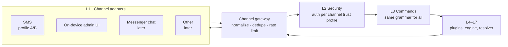

# Contact Channels — SMS First, Others Later

| Field | Value |
|-------|-------|
| **Status** | Proposal (draft v0.1) |
| **Date** | 2026-10-01 |
| **Depends on** | [README.md](README.md), [sms-security.md](sms-security.md) |
| **Decision record** | [ADR-008](../adr/ADR-008-channel-abstraction.md) |

## 1. Goal

SMS is **one** way to reach the agent, not the only one. The architecture must let new contact channels be added later **without changing** the command language, the policy engine, the plugins or the execution engine.

## 2. Core idea

Everything below the channel layer works on a **channel-neutral command envelope**. A channel adapter's only job is to turn its transport into envelopes and replies back into its transport.

### Command envelope

| Field | Meaning |
|-------|---------|
| `channel` | Adapter id (`sms`, `sms_b`, `local_ui`, …) |
| `sender` | Channel-specific identity (phone number, local session, …) |
| `body` | Command text in the common grammar ([sms-security.md](sms-security.md) section 3) |
| `auth` | Auth material the channel carried: a code-sheet entry, a verified MAC, a physical-presence flag |
| `received_at`, `channel_msg_id` | For expiry and de-duplication |
| `trust` | The channel's **trust profile** (section 4), set by the adapter, never by the message |

### Reply

The core produces a **structured reply** (status, short text, optional list for paging). The adapter **renders** it for its transport: an SMS adapter shortens, removes accents and pages with `MORE`; a richer channel can show more. Masking of sensitive values happens **in the core**, before any adapter sees the reply, based on the channel's confidentiality.

## 3. Channel adapter contract

Every adapter declares its capabilities, and the core reads them instead of assuming SMS:

| Capability | Example values |
|------------|----------------|
| `max_reply_chars` | 160 (SMS GSM-7), 70 (SMS with accents), large (local UI) |
| `confidential` | `false` (plain SMS), `true` (encrypted SMS profile B, local UI) |
| `sender_authenticated` | `false` (SMS number can be spoofed), `true` (local UI behind the device lock) |
| `delivery` | best effort / acknowledged |
| `interactive` | can it carry a two-step confirmation within the time window? |
| `needs_network` | whether the adapter itself needs Internet (see section 6) |

Adapters are **code in the base app**, not YAML plugins. They sit on the security boundary, so they follow the same rule as ADR-007: intelligence and trust stay in the base app.

## 4. Trust profiles and policy

The policy engine decides per command using **the command's risk level and the channel's trust profile**. A weak channel cannot do what a strong one can.

| Trust profile | Example channel | Max risk level (proposal) | Replies |
|---------------|-----------------|---------------------------|---------|
| `physical` | On-device admin UI | Admin operations (install plugins, change policy, beneficiaries) — **only here** | Full |
| `strong_remote` | Encrypted SMS profile B, with code sheet for level 5 | 5 (when transfers exist) | Confidential, but metadata visible |
| `weak_remote` | Plain SMS profile A + code sheet | 4 (balance/statement masked); 5 only with the two-step confirmation | Masked |
| `unauthenticated` | Anything without valid auth | 0 (`HELP`), plus `STOP` | Minimal or none |

Rules that do not change with the channel:

- **Admin operations are never remote**, whatever the channel.
- **`STOP` is accepted from every configured channel**, because it can only disable the agent.
- A command authenticated on one channel cannot be confirmed on another unless both are configured for that owner (avoids cross-channel confusion).
- Every channel has its own rate limits and sender allowlist; the code sheet is shared because it identifies the owner, not the channel.

## 5. Channels considered

| Channel | Status | Notes |
|---------|--------|-------|
| **SMS, profile A** (plain + code sheet) | **v1** | Works with any dumbphone |
| **SMS, profile B** (encrypted binary SMS) | Later, after Spike 8 | Needs a client on the dumbphone |
| **On-device admin UI** | **v1** | Physical presence; the only place for admin operations |
| **Messenger chat** (a dedicated Telegram/WhatsApp chat read through notifications and answered with `RemoteInput`) | Candidate | Our app needs no Internet permission: the messenger app does the networking. Inherits that messenger's risks (account ban, spoofed contact names), so it needs the same code-sheet authentication as SMS |
| **E-mail / web / bot API** | Candidate, constrained | Needs network access (section 6) |
| **Voice call with keypad tones** | Not viable as far as I know | Android does not give ordinary apps access to call audio or keypad tones of a live call |
| **USB / adb** | Development only | Not a product channel |

## 6. Channels that need the Internet

The base app aims to have **no `INTERNET` permission**, which is a verifiable way to back the "self-contained" claim. A channel that needs the network would break that if it lived in the base app. So:

- Network channels live in a **separate companion app** (its own APK and permission set) that talks to the base app over a local, authenticated IPC (bound service with a signature-level permission).
- The companion only moves envelopes and replies. It never sees secrets, plugins or policy.
- Installing a companion is an explicit owner decision in admin mode, and the "self-contained" claim is then documented as "self-contained except the companion's transport".

## 7. What this changes in the current plan

- Layer L1 in [README.md](README.md) becomes **Channel adapters + gateway**, with SMS as the first adapter.
- The command grammar, policy, dialogue and audit become **channel-neutral**. SMS-specific details (160 chars, accents, `MORE`, port SMS) stay inside the SMS adapter.
- Phase 3 builds the gateway and the SMS adapter together, so the second channel later is an adapter, not a refactor.
- The audit log records the channel of every command.
