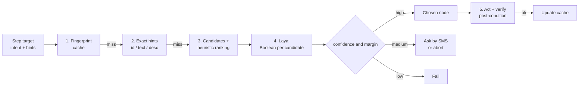

# Resilient Element Resolution with Laya

| Field | Value |
|-------|-------|
| **Status** | Proposal (draft v0.2) |
| **Depends on** | [README.md](README.md) (layers L6/L7), [plugins.md](plugins.md) |

## 1. What Laya is — and is not

Research done on 2026-09-30 from secondary sources (see "Sources"). **We have not yet checked the official model card or run the model**; that is Spike 2.

| Property | Reported value |
|----------|----------------|
| Type | Non-autoregressive **decision** model (encoder). It does **not** generate text |
| Input | **Text** (document/JSON) plus a typed question |
| Output | Probabilities: **Choice** (one option from a closed list), **Score** (ordinal scale), **Boolean** (probability a statement is true) |
| Variants | `laya` (ModernBERT-large, 421M, 512 context, English); `laya-multilingual` (mmBERT-base, 322M, 1024 context, 100+ languages); `laya-typed-decisions` (421M, 1024 context) |
| License | Apache 2.0 |
| Release | 2026-09-18 (very young project) |
| Latency | ~33 ms per question on a T4 GPU; ~72 ms for 10 batched questions |
| On Android (third-party port) | ONNX Runtime CPU, int8 weight-only `laya-multilingual`, ~649 MB, ~260 ms per decision on a 2-core CI runner |
| Zero-shot | ~0.36 accuracy — **close to random**; fine-tuning required |
| Fine-tuning | "A few thousand labelled examples"; reference notebook ~4 h on 2× T4 |
| Calibration | Raw confidence is poorly calibrated (ECE 0.466); 0.081 after temperature refit |
| Limits | Degrades beyond ~20 options; weak on non-Latin scripts; short context |

### Consequences for this project

1. **Laya cannot see the screen.** It is not a vision model. It reads **text**, and the accessibility tree is text. That is the natural fit.
2. **Screenshots can reach Laya only as OCR text** (section 4). That extends coverage to screens without a usable tree, but not to icon-only buttons.
3. **Icon-only elements** (no label, no `contentDescription`) are out of Laya's reach even with OCR, because OCR does not read drawings. They need a separate mechanism (icon classifier or local UI-grounding model). That is an open decision.
4. **One Boolean question per candidate, batched,** is better than a single choice among many options, given the ~20-option limit.
5. **Fine-tuning and calibration are mandatory**, on real screens of the target apps. The generic model is not usable.
6. **Portuguese support uses the multilingual variant** (mmBERT-base). It is the only variant with an Android port and covers Portuguese (Latin script).
7. **Cost:** ~650 MB on disk and significant memory. On the baseline device (Android 13, 6 GB) this is feasible if the model is loaded on demand and unloaded when idle. To be measured in Spike 1.
8. **Safety:** because it is not generative, its output is always an item from a list *we* define. That greatly lowers prompt-injection risk compared with an LLM agent. Text that comes from the screen can still be adversarial (section 8).

### Generic question, plugin-defined intents

Laya is asked one generic question: *"Does this UI element match this description?"* The description comes from the plugin's `intent` text ([plugins.md](plugins.md)). This lets a new plugin introduce new intent wording without retraining. How well the fine-tuned model generalizes to unseen intent phrasing is a measurable assumption, not a given (Spike 2).

## 2. Where it fits: the `ResolverPipeline`

The current `SelectorEngine` becomes a staged pipeline. Each stage runs only if the previous ones failed.



### Stage 1 — Fingerprint cache (self-healing)

When an element is resolved **and the post-condition confirms it**, store its fingerprint: class, `resource_id`, normalized text/description, relative position, neighbor and parent texts, the screen it was on, and the app version. Next run, try to match the fingerprint before anything else. When the app changes, Laya re-resolves and the cache is updated, so the automation heals itself.

### Stage 2 — Exact hints

The step declares deterministic hints (`resource_id`, `content_description`, `text`). This is the current POC behavior, unchanged.

### Stage 3 — Candidates and heuristic ranking

Collect the **actionable** nodes (clickable, editable, scrollable) and rank them with a cheap score (expected role, text similarity, screen region, proximity to anchors). Keep only the **top K (K ≤ 8)**. This keeps Laya far from the ~20-option limit and cuts latency.

### Stage 4 — Laya decision

One Boolean question per candidate, in a batch:

```
Question: "Is the element the button that sends the message in the chat?"
Document:
  screen: chat_open | app: com.whatsapp
  element: role=button; desc="Send"; id_tail="send"; region=bottom-right;
           left_neighbor="Message"; right_neighbor="—"
```

Rules:

- **Short, stable serialization.** The token budget is small (about 192–256 tokens per question per the sources; 1024 context on the multilingual variant). Fixed field order, truncated texts.
- **Only UI attributes go into the document.** Never the body of the user's messages (section 8).
- **Decision:** pick the top candidate with probability `p1` if `p1 ≥ τ_high` **and** the margin over the runner-up `p1 − p2 ≥ δ`. Between `τ_low` and `τ_high`: ask for confirmation or abort, depending on risk. Below `τ_low`: fail.
- **Thresholds by risk** (initial shape only; calibrate with real data):

| Action risk | `τ_high` | Behavior in the medium zone |
|-------------|----------|------------------------------|
| Read / navigation | lower | Try the next candidate |
| Send a message | intermediate | Abort and report by SMS |
| Financial | **Laya does not decide alone** | Requires a deterministic anchor (section 5) |

### Stage 5 — Post-condition verification

After acting, check the outcome (for example "the message shows as sent in the chat"). Only then update the cache. Without this, a resolution mistake would be "learned".

## 3. Other uses of Laya (in order of value)

| Use | Question | Type | Notes |
|-----|----------|------|-------|
| **Classify the screen** | "Which screen is this?" (a list of ≤ 20 known screen types: chat list, chat open, login, permission, error…) | Choice | Basis for knowing where we are and detecting interruptions |
| **Detect interruptions** | "Is this dialog an ad / permission / update?" | Choice | Feeds interrupt rules (see the action catalog) |
| **Verify a post-condition** | "Does the screen confirm the message was sent?" | Boolean | For high risk, complement with exact comparison |
| **Tolerate typos in SMS commands** | "Which intent does the command express?" | Choice | Only after the deterministic grammar fails; ≤ 20 intents; never for risk levels 4–5 |
| **Disambiguate contacts** | "Which alias does the text refer to?" | Choice | If probability is low, ask back by SMS |

> General rule: **exact values (amount, recipient, phone number) never go through a model.** They are extracted by regex/string comparison and checked literally.

## 4. Candidate sources: accessibility tree or OCR

The resolver is the same for both sources; only candidate extraction differs.

| Source | When | Candidate contents | Action |
|--------|------|--------------------|--------|
| **Accessibility tree** (default) | Tree is present and informative | Role, text, description, id, bounds, neighbors | `performAction` on the node |
| **OCR of a screenshot** | Tree is empty or opaque (canvas, Flutter without semantics, some WebViews) | Text blocks with bounding boxes and neighbors | `tap_xy` at the block's center |

OCR path details:

- Screenshot by `takeScreenshot` (API 30+). Windows with `FLAG_SECURE` return blank or an error, so this path **does not cover secure screens**, which include many bank screens.
- Each OCR block becomes a candidate with text **and region** (`region=bottom-right`, neighbors); loose text is not enough to tell two "Send" buttons apart.
- OCR errors ("Send" read as "S3nd") propagate into the decision. Add simulated OCR noise to the training examples.
- **Filter by region before building the document** (bottom bar, header, button areas). Never include the message area, or an attacker's chat text reaches the model (section 8).
- Coordinate taps cannot be verified by node identity, so rely on the post-condition (OCR again after the tap). **Irreversible actions still require a deterministic anchor**, so this path is not used for them.
- The OCR engine must run on-device with no cloud calls. Candidates to evaluate: an embedded ML Kit text recognizer, Tesseract, or an ONNX OCR model. **None has been tested**; compare pt-BR accuracy, size and latency.
- It costs capture + OCR + Laya in latency and battery, so it runs only as a fallback.

## 5. Irreversible actions: deterministic anchor required

For transfers and similar actions:

1. Laya may **suggest** candidates, but the final click happens only if there is a **deterministic anchor** (for example an exact `resource_id` **or** exact button text in the validated app version).
2. The app's confirmation screen is read from the tree and compared **literally** with what the user confirmed by SMS (amount and masked name/key).
3. Any field mismatch aborts before the final button.
4. Unknown app version (not in `tested_versions`): financial actions do not run.

## 6. Data and training

The model must learn **what "the send button" looks like on real screens**. Plan:

| Step | Description |
|------|-------------|
| **Collection** | "Recorder" mode on the device saves redacted tree snapshots plus the action that succeeded. Helper tools on a PC using `adb` / `uiautomator dump` |
| **Labeling** | (intent, candidate, true/false). Negatives are the other nodes on the same screen |
| **Synthetic augmentation** | Translate labels (pt/en), drop `desc`, obfuscate `resource_id`, reorder, add text noise and OCR noise |
| **Volume** | On the order of a few thousand examples per intent family (the Laya project's own reference) |
| **Training** | Off-device (development). Export int8 ONNX |
| **Calibration** | Per-question-type temperature refit on a held-out set |
| **Evaluation** | Golden set per app/version; regression on every new app or model version |

The agent device receives **only the final artifact** (model + calibration table + signature).

## 6.1 Mandatory baseline

Before integrating Laya, build the **heuristic ranker** (stage 3) and measure its hit rate on the golden set. Laya stays only if it improves that rate measurably. If it does not, the ranker stays and Laya becomes optional. This protects the project from the risk that the model (new, third-party Android port) does not deliver.

## 7. Evaluation metrics

| Metric | What it measures |
|--------|------------------|
| Correct resolution rate | % where the chosen node is the expected one (golden set) |
| Resolution rate under drift | Same, on other app versions or another language |
| False positive on sensitive action | % of clicks on the wrong element (target: ~0 at high risk, hence the deterministic anchor) |
| Calibration (ECE) | Stated confidence vs. real accuracy |
| Latency p50/p95 on device | Real cost of a decision |
| Cache hit rate | % of steps resolved without calling Laya |
| Tree vs. OCR gap | Accuracy lost on OCR where a tree exists, and gained where none does |

## 8. Specific risks

| Risk | Mitigation |
|------|-----------|
| Adversarial on-screen text tries to steer the decision (e.g. a received message saying "send button") | Only UI attributes go into the document; never message bodies; the output is a choice among candidates we enumerate; OCR is region-filtered |
| High confidence but wrong | Calibration, minimum margin, post-condition, deterministic anchor at high risk |
| New model, third-party port | Spike 2; heuristic baseline; own export/quantization if needed |
| Memory / battery | On-demand load, unload when idle, resolve only on cache miss |
| Icon-only screens | Out of Laya's reach; OCR/UI-grounding decision open |
| App language differs from fine-tuning | Multilingual augmentation; per-language evaluation |
| Unseen plugin intent wording | Measure generalization; keep exact hints as primary |

## Sources

- [Laya: Technical Overview (Flowtivity)](https://flowtivity.ai/blog/laya-open-source-jev-alternative/)
- [Jev vs Laya: The Same AI Idea, One Closed and One Open (DEV Community)](https://dev.to/jamilxt/jev-vs-laya-the-same-ai-idea-one-closed-and-one-open-3c6e)
- [laya-android — third-party Android port](https://github.com/edwardmonteiro/laya-android)
- [Best Open Source Jev Alternatives (Pinggy)](https://pinggy.io/blog/best_open_source_jev_alternatives_self_hosted_decision_models/)
